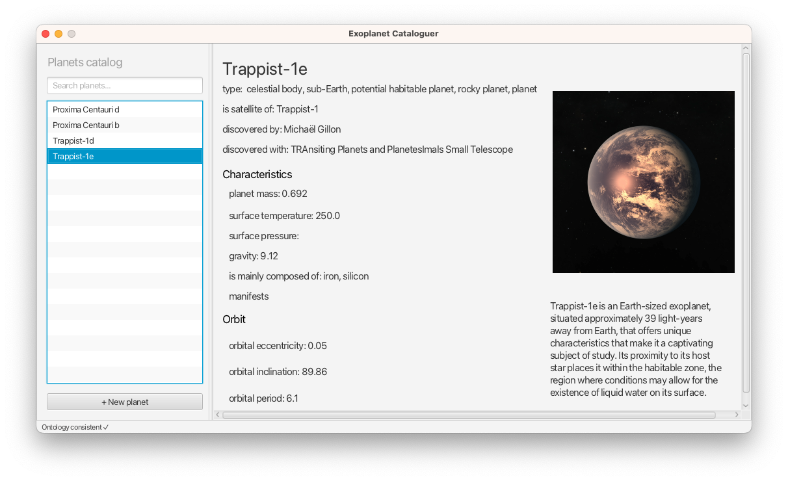

# Exoplanet Cataloguer

Exoplanet Cataloguer is a Java application that allows astronomy researchers to maintain their own catalog of exoplanets, helping them in their cataloguing and classification.

The application relies on a purpose-built OWL-DL ontology that describes the domain of exoplanet study and research.

Thanks to the [Apache Jena API](https://jena.apache.org/documentation/inference/index.html) and the [Pellet reasoner](https://github.com/Galigator/openllet), the application loads the ontology and performs reasoning on the schema and data defined within it, inferring new information such as the classification by mass of the planets, their potential habitability, their composition or the stellar classification of the stars they orbit around.

It should be specified that from a scientific point of view there are no well-defined parameters to deduce the habitability of an exoplanet as it depends on various factors and on the definitions and models used by scientists. For educational purposes of the project, limit ranges have been defined in which planets are usually considered potentially habitable.

For more details read the **[project report](Relazione_progetto.pdf)**.

This project has been realized as an exam project of the Knowledge Modeling and Management course 2022/23 of the computer science department of the University of Camerino, held by professors Michele Loreti, Lorenzo Rossi and Andrea Morichetta.

## Build & Run

1. Clone repository
    > git clone git@github.com:alessiorubicini/ExoplanetCataloguer.git

2. Build Gradle project
    > ./gradlew build

3. Run
    > ./gradlew run

## License
Copyright (c) 2023 Alessio Rubicini.

The license for this repository is MIT License.

Please see the [LICENSE](LICENSE) file for full reference.